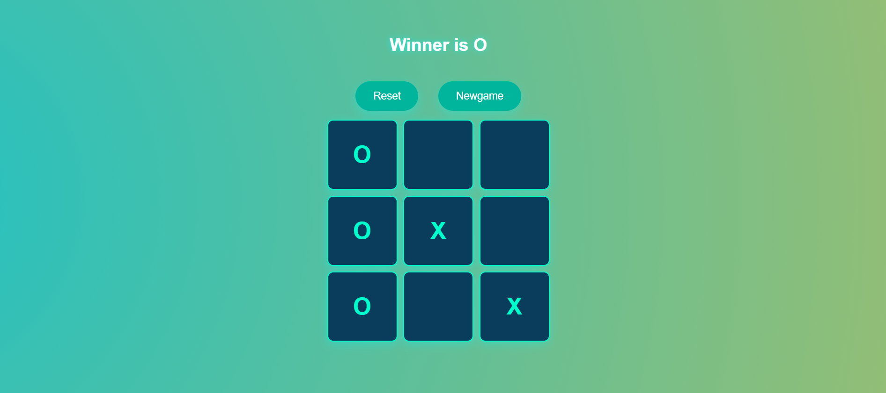

# Tic-Tac-Toe Game

This is a simple Tic-Tac-Toe game that allows two players to play against each other.

## Features

- Interactive game grid.
- Displays the winner or a draw.
- Reset and new game options.
- Animated and visually appealing interface.

## Folder Structure

```
project-directory/
|-- images/               # Contains all image assets
|   |-- astronaut.jpg     # Background image
|   |-- screenshot1.png   # Screenshot of the game grid
|   |-- screenshot2.png   # Screenshot showing a winning state
|-- index.html            # Main HTML file
```

## How to Use

1. Clone the repository or download the project files.
2. Open `index.html` in your browser to launch the game.

## File Descriptions

### `index.html`

The main HTML file that structures the game interface. It includes:

- A 3x3 grid for the Tic-Tac-Toe game.
- Buttons for resetting and starting a new game.
- Displays the winner or draw message.

### `style` (Embedded in HTML)

The CSS code provides styling for:

- The animated gradient background.
- Hover and click effects for the game grid.
- Reset and new game buttons with smooth transitions.

### `script` (Embedded in HTML)

The JavaScript code handles:

- Click events for each grid box.
- Determining the winner based on predefined patterns.
- Resetting and restarting the game.

## Screenshots

### Game Grid
(Screenshot 2025-01-27 221826.png)

### Winning State


## How It Works

1. Players take turns to mark `X` or `O` in the grid.
2. The game checks for a winner after each turn using predefined winning patterns.
3. If a player wins, the result is displayed, and the grid is disabled.
4. Players can reset the game to replay.

## Future Improvements

- Add AI to allow single-player mode.
- Enhance the UI/UX with additional animations and sound effects.
- Make the grid dynamically scalable for different screen sizes.

